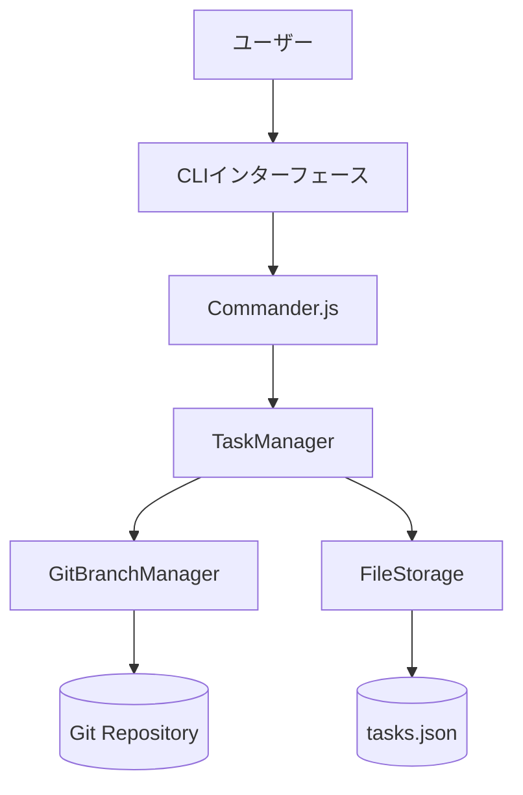
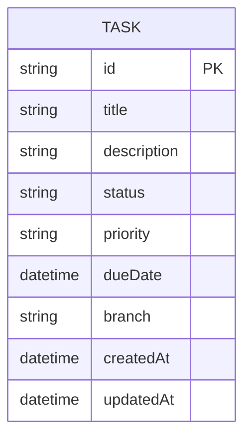
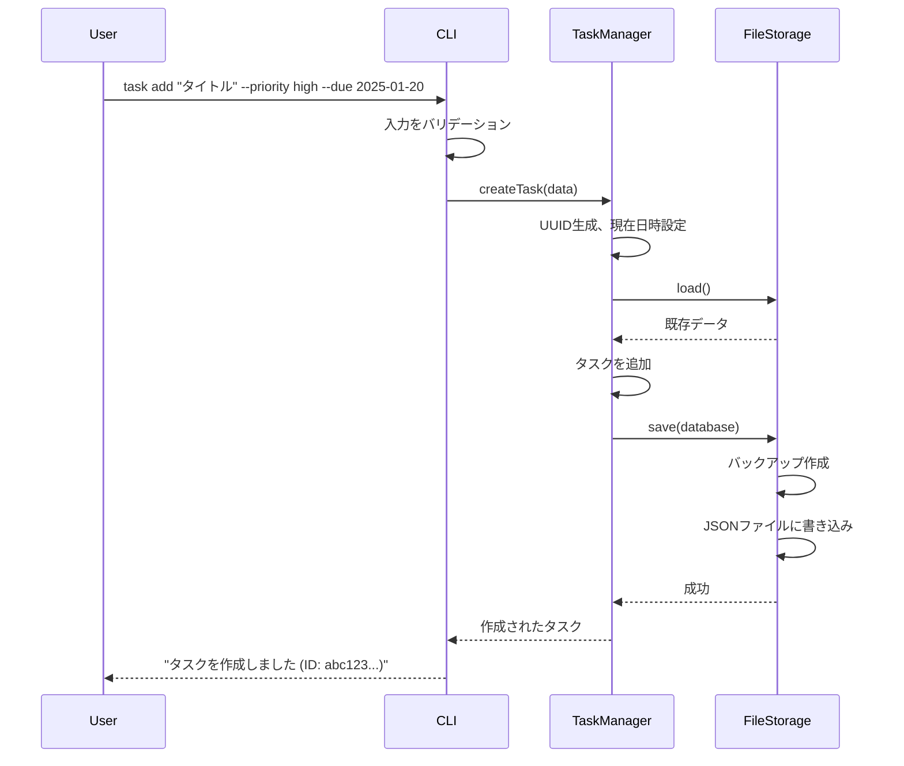
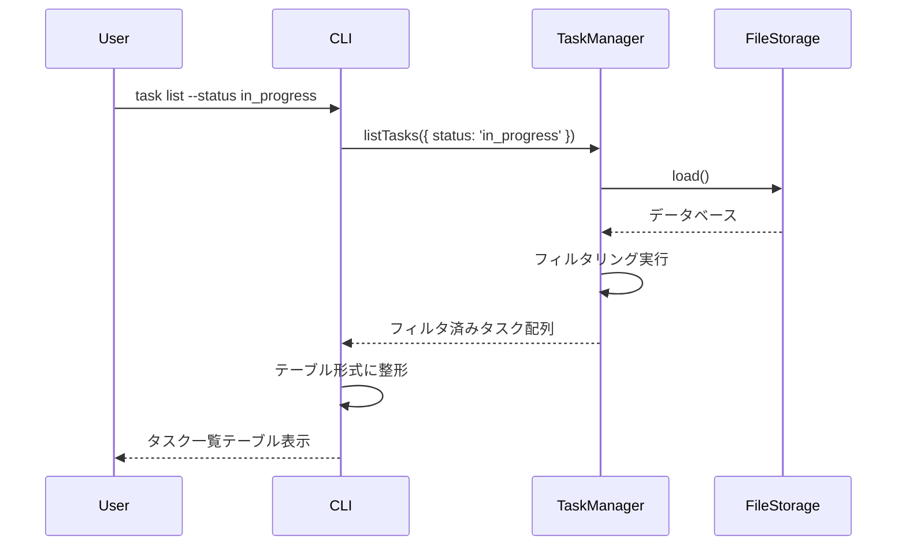
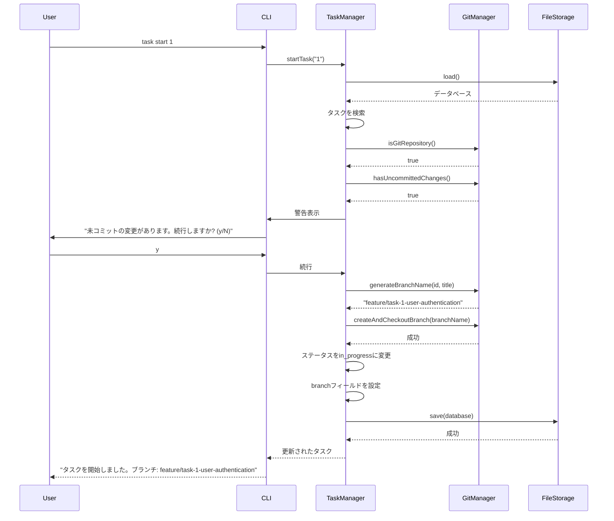
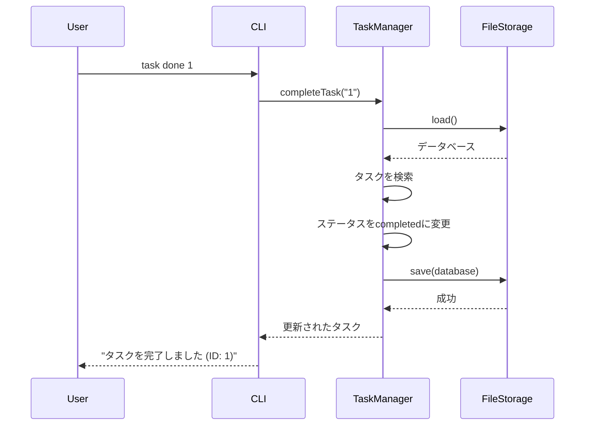

# 機能設計書 (Functional Design Document)

## システム構成図



**レイヤー構成**:
- **CLIレイヤー**: ユーザー入力の受付、コマンドパース、結果表示
- **サービスレイヤー**: ビジネスロジック(タスク管理、Git連携)
- **データレイヤー**: データの永続化、ファイル操作

## 技術スタック

| 分類 | 技術 | 選定理由 |
|------|------|----------|
| 言語 | TypeScript 5.x | 静的型付けによりコンパイル時にバグを検出でき保守性が向上。IDEの補完機能が強力で開発効率が高い。型定義の共有によりコードの可読性と品質が担保される。 |
| ランタイム | Node.js v22.x (LTS) | 2027年4月までの長期サポート保証により本番環境での安定稼働が期待できる。非同期I/O処理に優れ、CLIツールとして高いパフォーマンスを発揮。npmエコシステムが充実。 |
| CLIフレームワーク | Commander.js ^12.0.0 | シンプルで学習コストが低い。コマンド・オプションの定義が直感的。十分な機能を持ちつつ軽量。GitやDockerなど多くのCLIツールで実績がある。 |
| Git操作 | simple-git ^3.25.0 | Node.jsで最も広く使われているGitライブラリ。Promise/async-awaitに対応。型定義ファイルが公式提供されている。 |
| データ保存 | JSON (fs) | MVPはシンプルに、特別な依存なし |
| テーブル表示 | cli-table3 ^0.6.5 | 美しいテーブル表示が可能。カラム幅の自動調整。カスタマイズ性が高い。 |
| カラー表示 | chalk ^5.3.0 | 直感的なAPI。軽量で高速。ANSI色対応ターミナルで広くサポートされている。 |
| 日付処理 | date-fns ^3.6.0 | 軽量でTree-shakable。TypeScript対応。moment.jsより軽量で関数型アプローチを採用。 |

## データモデル定義

### エンティティ: Task

```typescript
interface Task {
  id: string;                    // UUID v4で自動生成
  title: string;                 // タスクタイトル、1-200文字、必須
  description?: string;          // タスク説明、Markdown形式、オプション
  status: TaskStatus;            // タスクステータス、デフォルト'open'
  priority?: TaskPriority;       // 優先度、オプション(high/medium/low)
  dueDate?: Date;                // 期限、ISO 8601形式、オプション
  branch?: string;               // 紐づくGitブランチ名、task start時に自動設定
  createdAt: Date;               // 作成日時、自動設定
  updatedAt: Date;               // 更新日時、自動更新
}

type TaskStatus = 'open' | 'in_progress' | 'completed' | 'archived';
type TaskPriority = 'high' | 'medium' | 'low';
```

**状態遷移ルール**:
- `open` → `in_progress`: `task start`コマンド実行時
- `in_progress` → `completed`: `task done`コマンド実行時
- `in_progress` → `open`: タスクを中断した場合
- `completed` → `archived`: `task archive`コマンド実行時
- `open` → `completed`への直接遷移は禁止

詳細な状態遷移図は[glossary.md](./glossary.md#タスクステータス-task-status)を参照。

**制約**:
- `id`: UUID v4形式、システムが自動生成、ユーザーからの変更不可
- `title`: 1-200文字、空文字列不可
- `status`: 定義された4つの値のみ許可
- `priority`: 定義された3つの値のみ許可、未指定も可
- `dueDate`: ISO 8601形式(YYYY-MM-DD)、過去の日付も許可
- `branch`: Git branch name規則に準拠、`feature/task-<id>-<slug>`形式

### データファイル構造

```typescript
interface TaskDatabase {
  version: string;               // データフォーマットバージョン、現在"1.0"
  tasks: Task[];                 // タスク配列
}
```

### ER図



## コンポーネント設計

### CLIレイヤー

#### CLI (CommandLineInterface)

**責務**:
- コマンドラインからのユーザー入力を受け付ける
- Commander.jsを使用してコマンドとオプションをパース
- TaskManagerからの結果を整形してユーザーに表示
- エラーメッセージを分かりやすく表示

**インターフェース**:
```typescript
class CLI {
  constructor(taskManager: TaskManager);

  // アプリケーションの起動
  run(argv: string[]): Promise<void>;

  // タスク一覧を表形式で表示
  displayTaskList(tasks: Task[]): void;

  // タスク詳細を表示
  displayTaskDetail(task: Task): void;

  // 成功メッセージを表示
  displaySuccess(message: string): void;

  // エラーメッセージを表示
  displayError(error: Error): void;
}
```

**依存関係**:
- TaskManager (タスク操作)
- chalk (カラー表示)
- cli-table3 (テーブル表示)

### サービスレイヤー

#### TaskManager

**責務**:
- タスクのCRUD操作のビジネスロジック
- タスクIDの生成
- タスクのバリデーション
- タスクのフィルタリング・ソート
- FileStorageを使ったデータ永続化

**インターフェース**:
```typescript
interface CreateTaskData {
  title: string;
  description?: string;
  priority?: TaskPriority;
  dueDate?: Date;
}

interface UpdateTaskData {
  title?: string;
  description?: string;
  status?: TaskStatus;
  priority?: TaskPriority;
  dueDate?: Date;
  branch?: string;
}

interface FilterOptions {
  status?: TaskStatus;
  priority?: TaskPriority;
}

class TaskManager {
  constructor(storage: FileStorage, gitManager: GitBranchManager);

  // タスクを作成
  createTask(data: CreateTaskData): Task;

  // タスク一覧を取得(フィルタリング可能)
  listTasks(filter?: FilterOptions): Task[];

  // タスクIDでタスクを取得
  getTask(id: string): Task | null;

  // タスクを更新
  updateTask(id: string, data: UpdateTaskData): Task;

  // タスクを削除
  deleteTask(id: string): void;

  // タスクを開始(ステータス変更 + Gitブランチ作成)
  startTask(id: string): Task;

  // タスクを完了(ステータスをcompletedに変更)
  completeTask(id: string): Task;

  // タスクをアーカイブ
  archiveTask(id: string): Task;
}
```

**依存関係**:
- FileStorage (データ永続化)
- GitBranchManager (Git操作)

#### GitBranchManager

**責務**:
- Gitリポジトリの状態確認
- ブランチの作成と切り替え
- 未コミットの変更の検出
- ブランチ名のslug生成

**インターフェース**:
```typescript
class GitBranchManager {
  constructor(repoPath: string);

  // Gitリポジトリが存在するか確認
  isGitRepository(): Promise<boolean>;

  // 未コミットの変更があるか確認
  hasUncommittedChanges(): Promise<boolean>;

  // ブランチを作成して切り替え
  createAndCheckoutBranch(branchName: string): Promise<void>;

  // タスクIDとタイトルからブランチ名を生成
  // - branchName形式: `feature/task-<id先頭8文字>-<slug>`
  // - slug生成ルール:
  //   1. 日本語文字は削除
  //   2. 英数字以外の文字は'-'に変換
  //   3. 連続する'-'は1つに統合
  //   4. 先頭・末尾の'-'は削除
  //   5. 小文字に変換
  //   6. 最大30文字に切り詰め
  // - 例: "ユーザー認証機能の実装" → "feature/task-7a5c6ff0-user-authentication"
  generateBranchName(taskId: string, title: string): string;

  // 現在のブランチ名を取得
  getCurrentBranch(): Promise<string>;
}
```

**依存関係**:
- simple-git (Git操作)

### データレイヤー

#### FileStorage

**責務**:
- タスクデータのJSON形式での保存・読み込み
- バックアップファイルの作成(最新1世代のみ保持)
- ファイルの存在確認
- エラーからの復旧

**バックアップ戦略の限界**:
- MVP版では最新1世代のみ保持(書き込み前のスナップショット)
- 連続した書き込み操作では中間状態は保存されない
- データ復旧は直前の1回分の操作のみ可能
- 将来的な拡張: タイムスタンプ付き複数世代管理、自動クリーンアップ機能を検討

**インターフェース**:
```typescript
class FileStorage {
  constructor(filePath: string);

  // データを保存(バックアップ作成後に保存)
  save(database: TaskDatabase): void;

  // データを読み込み
  load(): TaskDatabase;

  // ファイルが存在するか確認
  exists(): boolean;

  // バックアップファイルを作成
  createBackup(): void;

  // バックアップから復旧
  restoreFromBackup(): TaskDatabase;

  // 初期データベースを作成
  initializeDatabase(): TaskDatabase;
}
```

**依存関係**:
- fs (Node.js標準ライブラリ)

## ユースケース図

### ユースケース1: タスク作成



**フロー説明**:
1. ユーザーが`task add`コマンドを実行
2. CLIが入力をバリデーション(タイトル長さ、日付形式など)
3. TaskManagerがタスクオブジェクトを作成(UUID生成、デフォルト値設定)
4. FileStorageから既存データを読み込み
5. 新しいタスクを配列に追加
6. バックアップファイル作成後、JSONファイルに保存
7. 成功メッセージを表示

### ユースケース2: タスク一覧表示



**フロー説明**:
1. ユーザーが`task list`コマンドを実行(オプションでフィルタ指定)
2. TaskManagerがFileStorageからデータを読み込み
3. フィルタ条件に基づいてタスクを絞り込み
4. CLIがcli-table3を使ってテーブル形式で表示
5. ステータスと優先度をchalkでカラーコーディング

### ユースケース3: タスク開始(Git連携)



**フロー説明**:
1. ユーザーが`task start <id>`コマンドを実行
2. TaskManagerが対象タスクを検索
3. GitManagerでGitリポジトリの存在を確認
4. 未コミットの変更があれば警告表示、ユーザーに確認
5. タスクIDとタイトルからブランチ名を生成(`feature/task-<id>-<slug>`)
6. ブランチを作成して切り替え
7. タスクステータスを`in_progress`に変更、branchフィールドを設定
8. データを保存して成功メッセージを表示

### ユースケース4: タスク完了



**フロー説明**:
1. ユーザーが`task done <id>`コマンドを実行
2. TaskManagerが対象タスクを検索
3. タスクステータスを`completed`に変更
4. データを保存して成功メッセージを表示

## UI設計

### テーブル表示

**`task list`の表示項目**:
| 項目 | 説明 | フォーマット |
|------|------|-------------|
| ID | タスクID | UUID先頭8文字のみ表示 |
| Status | ステータス | 日本語表示(未着手/進行中/完了/アーカイブ) |
| Priority | 優先度 | 記号表示(🔴高/🟡中/🔵低/- なし) |
| Title | タイトル | 最大40文字、超過時は省略(…) |
| Branch | Gitブランチ | 最大30文字、未設定時は"-" |

**表示例**:
```
┌──────────┬────────────┬──────────┬────────────────────────┬────────────────────────┐
│ ID       │ Status     │ Priority │ Title                  │ Branch                 │
├──────────┼────────────┼──────────┼────────────────────────┼────────────────────────┤
│ 7a5c6ff0 │ 進行中      │ 🔴 高    │ ユーザー認証機能の実装   │ feature/task-1-user... │
│ 8b3d4aa1 │ 未着手      │ - なし   │ データエクスポート機能   │ -                      │
│ 9c2e5bb2 │ 完了        │ 🟡 中    │ 初期セットアップ        │ feature/task-3-init... │
└──────────┴────────────┴──────────┴────────────────────────┴────────────────────────┘
```

**`task show <id>`の表示項目**:
```
タスク詳細
─────────────────────────────
ID:          7a5c6ff0-5f55-474e-baf7-ea13624d73a4
タイトル:     ユーザー認証機能の実装
説明:         JWT認証を実装する
              - ログインエンドポイント作成
              - トークン生成・検証
ステータス:   進行中
優先度:       高
期限:         2025-01-20 (あと5日)
ブランチ:     feature/task-1-user-authentication
作成日時:     2025-01-10 14:30:00
更新日時:     2025-01-15 09:15:00
```

### カラーコーディング

**ステータスの色分け**:
- `open` (未着手): 白
- `in_progress` (進行中): 黄 (chalk.yellow)
- `completed` (完了): 緑 (chalk.green)
- `archived` (アーカイブ): 灰 (chalk.gray)

**優先度の色分け**:
- `high` (高): 赤 (chalk.red) + 🔴
- `medium` (中): 黄 (chalk.yellow) + 🟡
- `low` (低): 青 (chalk.blue) + 🔵
- 未設定: 白 + "-"

**期限の色分け**:
- 期限超過: 赤 (chalk.red)
- あと3日以内: 黄 (chalk.yellow)
- それ以外: 白

## ファイル構造

**データ保存ディレクトリ**:
```
.task/
├── tasks.json         # タスクデータ本体
├── tasks.json.backup  # バックアップファイル(書き込み前に自動作成)
└── config.json        # 設定ファイル(将来的な拡張用)
```

**tasks.jsonの構造**:
```json
{
  "version": "1.0",
  "tasks": [
    {
      "id": "7a5c6ff0-5f55-474e-baf7-ea13624d73a4",
      "title": "ユーザー認証機能の実装",
      "description": "JWT認証を実装する",
      "status": "in_progress",
      "priority": "high",
      "dueDate": "2025-01-20T00:00:00.000Z",
      "branch": "feature/task-1-user-authentication",
      "createdAt": "2025-01-10T14:30:00.000Z",
      "updatedAt": "2025-01-15T09:15:00.000Z"
    }
  ]
}
```

## パフォーマンス最適化

- **遅延ロード**: Gitリポジトリチェックは必要な時のみ実行(task start時のみ)
- **メモリ効率**: タスク一覧は全件読み込み後、メモリ上でフィルタリング(1000件程度なら十分高速)
- **ファイルI/O最小化**: 1コマンド実行あたり最大2回(load, save)のファイル操作
- **インデックス不要**: MVPではタスク数が少ないため、配列の線形探索で十分

## セキュリティ考慮事項

- **ファイルパーミッション**:
  - **macOS/Linux**: `.task/tasks.json`作成時にパーミッション600(所有者のみ読み書き)を設定
  - **Windows**: NTFSのACL設定により現在のユーザーのみアクセス可能にする(`fs.chmod`は機能しないため、環境判定が必要)
  - **実装**: `process.platform`でOSを判定し、環境に応じた適切なセキュリティ設定を適用
- **パストラバーサル対策**: ユーザー入力から直接ファイルパスを構築しない
- **JSONインジェクション対策**: JSON.parse/stringifyを使用、外部ライブラリは使用しない
- **コマンドインジェクション対策**: simple-gitライブラリを使用し、シェル経由のgitコマンド実行は行わない

## エラーハンドリング

### エラーの分類

| エラー種別 | 処理 | ユーザーへの表示 |
|-----------|------|-----------------|
| タスクが見つからない | 処理を中断、エラーコード1で終了 | `Error: タスクが見つかりません (ID: xxx)` |
| タイトルが空 | 処理を中断、エラーコード1で終了 | `Error: タイトルは1-200文字で入力してください` |
| 不正なステータス値 | 処理を中断、エラーコード1で終了 | `Error: ステータスは open/in_progress/completed/archived のいずれかを指定してください` |
| データファイル読み込みエラー | 空の初期データで続行、警告表示 | `Warning: データファイルが見つかりません。新規作成します` |
| JSONパースエラー | バックアップから復旧を試行 | `Error: データファイルが破損しています。バックアップから復旧します...` |
| バックアップもパースエラー | 手動修正を依頼してエラー終了 | `Error: データファイルとバックアップの両方が破損しています。.task/tasks.jsonを手動で修正してください` |
| ファイル書き込みエラー | 処理を中断、エラーコード1で終了 | `Error: データファイルへの書き込みに失敗しました: [詳細]` |
| Gitリポジトリなし | 警告表示、Git連携機能をスキップして続行 | `Warning: Gitリポジトリが見つかりません。ブランチ作成をスキップします` |
| 未コミットの変更あり | 警告表示、ユーザーに確認を求める | `Warning: 未コミットの変更があります。続行しますか? (y/N)` |
| ブランチ作成失敗 | 処理を中断、エラーコード1で終了 | `Error: ブランチの作成に失敗しました: [詳細]` |

### エラーメッセージの設計原則

1. **明確な原因提示**: 何が問題かを具体的に示す
2. **対処法の提示**: ユーザーが何をすべきか明記
3. **平易な言葉**: 技術用語を避け、分かりやすく
4. **エラーコード**: プログラムで判定可能なエラーコード(0=成功, 1=エラー)

## テスト戦略

### ユニットテスト

- **TaskManager**: 各メソッドの正常系・異常系
  - createTask: タスク作成、バリデーション
  - listTasks: フィルタリング、空配列
  - getTask: 存在するID、存在しないID
  - updateTask: 正常更新、存在しないID
  - deleteTask: 正常削除、存在しないID
- **GitBranchManager**: Git操作のモック
  - generateBranchName: slug生成の正確性
  - isGitRepository: 正常系・異常系
  - createAndCheckoutBranch: 成功・失敗
- **FileStorage**: ファイルI/Oのモック
  - save/load: 正常系
  - バックアップ作成: ファイル存在確認
  - 復旧処理: パースエラー時の挙動

### 統合テスト

- **タスクCRUDフロー**: 作成→一覧→詳細→更新→削除
- **Git連携フロー**: タスク作成→開始→ブランチ確認
- **エラーハンドリング**: データファイル破損時の復旧

### E2Eテスト

- **基本操作**: `task add` → `task list` → `task start` → `task done`
- **フィルタリング**: `task list --status in_progress`
- **エラーケース**: 存在しないタスクID指定時のエラーメッセージ
