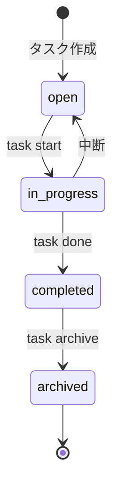

# プロジェクト用語集 (Glossary)

## 概要

このドキュメントは、TaskCLIプロジェクト内で使用される用語の定義を管理します。

**更新日**: 2025-01-03

## ドメイン用語

プロジェクト固有のビジネス概念や機能に関する用語。

### タスク (Task)

**定義**: ユーザーが完了すべき作業の単位。

**説明**:
タスクは、タイトル、説明、ステータス、優先度、期限、Gitブランチなどの属性を持ちます。タスクの作成から完了までのライフサイクル全体を管理します。

**関連用語**:
- [タスクステータス](#タスクステータス-task-status)
- [優先度](#優先度-priority)
- [Gitブランチ](#gitブランチ-git-branch)

**使用例**:
- 「タスクを追加する」: 新しいタスクをシステムに登録する
- 「タスクを開始する」: タスクのステータスをin_progressに変更し、Gitブランチを作成
- 「タスクを完了する」: タスクのステータスをcompletedに変更

**データモデル**: `src/types/Task.ts`

**英語表記**: Task

### タスクステータス (Task Status)

**定義**: タスクの進行状態を示す4段階の列挙型。

**取りうる値**:

| ステータス | 意味 | 遷移条件 | 次の状態 |
|----------|------|---------|---------|
| `open` | 未着手 | タスク作成時の初期状態 | `in_progress` |
| `in_progress` | 進行中 | ユーザーが`task start`を実行 | `completed`, `open` |
| `completed` | 完了 | ユーザーが`task done`を実行 | `archived` |
| `archived` | アーカイブ | ユーザーが`task archive`を実行 | - |

**状態遷移図**:


**実装**: `src/types/Task.ts`

**ビジネスルール**:
- `open` → `completed` への直接遷移は禁止
- アーカイブされたタスクは変更不可
- デフォルトの一覧表示では`archived`は除外される

**英語表記**: Task Status

### 優先度 (Priority)

**定義**: タスクの重要度を示す3段階の指標。

**値の定義**:
- `high`: 高優先度。緊急かつ重要で即座に対応が必要
- `medium`: 中優先度。重要だが緊急ではない
- `low`: 低優先度。重要度・緊急度ともに低い

**判断基準**:
- high: 期限が3日以内、または他のタスクをブロックする
- medium: 期限が1週間以内
- low: 期限が1週間以上先、または期限なし

**関連用語**: [タスク](#タスク-task)

**使用例**:
```typescript
const task: Task = {
  title: 'セキュリティ脆弱性の修正',
  priority: 'high', // 緊急対応が必要
};
```

**実装**: `src/types/Task.ts`

**英語表記**: Priority

### Gitブランチ (Git Branch)

**定義**: タスクに紐づくGitブランチ。`task start`コマンドで自動作成される。

**説明**:
タスクを開始すると、`feature/task-<id>-<slug>`形式のブランチが自動的に作成され、現在のブランチから切り替わります。これにより、タスクとコードの変更を1対1で紐付けることができます。

**命名規則**:
- パターン: `feature/task-<id>-<slug>`
- id: タスクIDの先頭8文字
- slug: タイトルの小文字英数字ハイフン区切り、最大30文字

**例**:
- タスクタイトル: 「ユーザー認証機能の実装」
- ブランチ名: `feature/task-7a5c6ff0-user-authentication`

**関連用語**:
- [タスク](#タスク-task)
- [Git Flow](#git-flow)

**実装**: `src/services/GitBranchManager.ts`

**英語表記**: Git Branch

### ステアリングファイル (Steering File)

**定義**: 特定の開発作業における「今回何をするか」を定義する一時的なドキュメント。

**説明**:
ステアリングファイルは `.steering/[YYYYMMDD]-[task-name]/` ディレクトリに配置され、特定の作業に関する要求内容、設計、タスクリストを記録します。作業完了後は履歴として保持されます。

**ディレクトリ構造**:
```
.steering/
└── 20250115-add-priority-feature/
    ├── requirements.md      # 今回の作業の要求内容
    ├── design.md            # 変更内容の設計
    └── tasklist.md          # タスクリスト
```

**命名規則**: `YYYYMMDD-kebab-case-task-name`

**関連用語**:
- [永続ドキュメント](#永続ドキュメント-persistent-documents)

**使用例**:
- 「新機能追加のためにステアリングファイルを作成する」
- 「タスク完了後、ステアリングファイルを履歴として保持する」

**英語表記**: Steering File

### 永続ドキュメント (Persistent Documents)

**定義**: プロジェクト全体の「何を作るか」「どう作るか」を定義する長期保存ドキュメント。

**含まれるドキュメント**:
- `docs/product-requirements.md`: プロダクト要求定義書
- `docs/functional-design.md`: 機能設計書
- `docs/architecture.md`: アーキテクチャ設計書
- `docs/repository-structure.md`: リポジトリ構造定義書
- `docs/development-guidelines.md`: 開発ガイドライン
- `docs/glossary.md`: 用語集

**関連用語**: [ステアリングファイル](#ステアリングファイル-steering-file)

**特徴**:
- プロジェクトの基本設計を記述
- 頻繁に更新されない
- プロジェクト全体の「北極星」として機能

**英語表記**: Persistent Documents

## 技術用語

プロジェクトで使用している技術・フレームワーク・ツールに関する用語。

### TypeScript

**定義**: JavaScriptに静的型付けを追加したプログラミング言語。

**公式サイト**: https://www.typescriptlang.org/

**本プロジェクトでの用途**:
全てのソースコードをTypeScriptで記述し、型安全性を確保しています。コンパイル時の型チェックにより、バグの早期発見と開発効率の向上を実現しています。

**バージョン**: 5.x

**選定理由**:
- 静的型付けによるコンパイル時のバグ検出
- IDEの補完機能による開発効率向上
- チーム開発における型定義の共有による可読性向上

**代替技術**:
- JavaScript ESM: 型チェックの恩恵が受けられない
- Flow: エコシステムの成熟度でTypeScriptに劣る

**関連ドキュメント**:
- [アーキテクチャ設計書](./architecture.md#技術スタック)
- [開発ガイドライン](./development-guidelines.md#コーディング規約)

**設定ファイル**: `tsconfig.json`

### Node.js

**定義**: JavaScriptランタイム環境。サーバーサイドやCLIツールの実行に使用。

**公式サイト**: https://nodejs.org/

**本プロジェクトでの用途**:
TaskCLIツールの実行環境として使用。非同期I/O処理に優れ、CLIツールとして高いパフォーマンスを発揮します。

**バージョン**: v22.x (LTS)

**選定理由**:
- 2027年4月までの長期サポート保証
- npmエコシステムの充実
- 非同期I/O処理に優れる

**関連ドキュメント**: [アーキテクチャ設計書](./architecture.md#技術スタック)

### Commander.js

**定義**: Node.js用のCLIフレームワーク。

**公式サイト**: https://github.com/tj/commander.js

**本プロジェクトでの用途**:
コマンドラインインターフェースの構築に使用。コマンド、オプション、引数のパースと定義を直感的に実装できます。

**バージョン**: ^12.0.0

**選定理由**:
- シンプルで学習コストが低い
- 十分な機能を持ちつつ軽量
- Git、Dockerなど多くのCLIツールで実績がある

**代替技術**:
- oclif: 多機能だが学習コストが高い
- yargs: 柔軟だが設定が複雑

**実装**: `src/cli/CLI.ts`

**関連ドキュメント**: [機能設計書](./functional-design.md#cliレイヤー)

### simple-git

**定義**: Node.jsでGit操作を行うためのライブラリ。

**公式サイト**: https://github.com/steveukx/git-js

**本プロジェクトでの用途**:
Gitリポジトリの状態確認、ブランチの作成・切り替え、未コミットの変更検出などに使用。

**バージョン**: ^3.25.0

**選定理由**:
- Node.jsで最も広く使われているGitライブラリ
- Promise/async-awaitに対応
- 型定義ファイルが公式提供されている

**実装**: `src/services/GitBranchManager.ts`

**関連ドキュメント**: [機能設計書](./functional-design.md#gitbranchmanager)

### Vitest

**定義**: Viteベースの高速テストフレームワーク。

**公式サイト**: https://vitest.dev/

**本プロジェクトでの用途**:
ユニットテスト、統合テスト、カバレッジ測定に使用。TypeScript/ESMをネイティブサポートし、高速起動・実行を実現します。

**バージョン**: ^2.0.0

**選定理由**:
- 高速起動・実行
- TypeScript/ESMネイティブサポート
- カバレッジ測定が標準搭載
- モダンな開発体験とHMR対応

**代替技術**:
- Jest: 広く使われているが、ESM対応が不十分
- Mocha: 設定が複雑

**設定ファイル**: `vitest.config.ts`

**関連ドキュメント**: [開発ガイドライン](./development-guidelines.md#テスト戦略)

### chalk

**定義**: ターミナルでのカラー表示を実現するライブラリ。

**公式サイト**: https://github.com/chalk/chalk

**本プロジェクトでの用途**:
タスクステータス、優先度、エラーメッセージの色分け表示に使用。

**バージョン**: 5.3.0

**選定理由**:
- 直感的なAPI
- 軽量で高速
- ANSI色対応ターミナルで広くサポートされている

**実装**: `src/formatters/TableFormatter.ts`

### cli-table3

**定義**: ターミナルでの美しいテーブル表示を実現するライブラリ。

**公式サイト**: https://github.com/cli-table/cli-table3

**本プロジェクトでの用途**:
`task list`コマンドのテーブル表示に使用。

**バージョン**: ^0.6.5

**選定理由**:
- 美しいテーブル表示が可能
- カラム幅の自動調整
- カスタマイズ性が高い

**実装**: `src/formatters/TableFormatter.ts`

## 略語・頭字語

### CLI

**正式名称**: Command Line Interface

**意味**: コマンドラインから操作するインターフェース。

**本プロジェクトでの使用**:
TaskCLIツールのメインインターフェース。ユーザーは`task add "タスク"`のようなコマンドでタスクを操作します。

**実装**: `src/cli/` ディレクトリ

**代替インターフェース**: GUI版の実装は将来の拡張として検討中

### MVP

**正式名称**: Minimum Viable Product

**意味**: 最小限の機能を持つ製品。顧客に価値を提供できる最小単位。

**本プロジェクトでの使用**:
MVPとして定義されたP0機能(タスクCRUD、ステータス管理、Git連携、フィルタリング、データ永続化)を最優先で実装します。

**関連ドキュメント**: [PRD](./product-requirements.md#機能要件)

### UUID

**正式名称**: Universally Unique Identifier

**意味**: 全世界で一意な識別子。

**本プロジェクトでの使用**:
タスクIDとしてUUID v4を使用。衝突のリスクなく、分散環境でも一意性を保証します。

**実装**: `uuid`ライブラリを使用してタスクID生成

### TDD

**正式名称**: Test-Driven Development

**意味**: テスト駆動開発。テストを先に書いてから実装を行う開発手法。

**本プロジェクトでの適用**:
全ての新機能開発でTDDを推奨しています。

**手順**:
1. テストを書く
2. テストを実行 → 失敗を確認
3. 実装を書く
4. テストを実行 → 成功を確認
5. リファクタリング

**関連ドキュメント**: [開発ガイドライン](./development-guidelines.md#テスト戦略)

### PR

**正式名称**: Pull Request

**意味**: Gitでコード変更をレビュー・マージするための仕組み。

**本プロジェクトでの使用**:
全てのコード変更はPRを通してレビューされ、承認後にマージされます。

**関連用語**: [Git Flow](#git-flow)

**関連ドキュメント**: [開発ガイドライン](./development-guidelines.md#プルリクエストプロセス)

## アーキテクチャ用語

システム設計・アーキテクチャに関する用語。

### レイヤードアーキテクチャ (Layered Architecture)

**定義**: システムを役割ごとに複数の層に分割し、上位層から下位層への一方向の依存関係を持たせる設計パターン。

**本プロジェクトでの適用**:
3層アーキテクチャを採用しています:

```
CLIレイヤー (src/cli/)
    ↓
サービスレイヤー (src/services/)
    ↓
データレイヤー (src/storage/)
```

**各層の責務**:
- **CLIレイヤー**: ユーザー入力の受付、バリデーション、結果の表示
- **サービスレイヤー**: ビジネスロジックの実装、タスク管理、Git連携
- **データレイヤー**: データの永続化、JSONファイル読み書き、バックアップ管理

**メリット**:
- 関心の分離による保守性向上
- テストが容易(各層を独立してテスト可能)
- 変更の影響範囲が限定的

**依存関係のルール**:
- ✅ CLIレイヤー → サービスレイヤー
- ✅ サービスレイヤー → データレイヤー
- ❌ データレイヤー → サービスレイヤー
- ❌ サービスレイヤー → CLIレイヤー

**関連ドキュメント**:
- [アーキテクチャ設計書](./architecture.md#アーキテクチャパターン)
- [リポジトリ構造](./repository-structure.md#ディレクトリ詳細)

### CLIレイヤー

**定義**: ユーザー入力の受付と結果の表示を担当するレイヤー。

**責務**:
- コマンドラインからのユーザー入力を受け付ける
- Commander.jsを使用してコマンドとオプションをパース
- サービスレイヤーからの結果を整形してユーザーに表示
- エラーメッセージを分かりやすく表示

**主要コンポーネント**:
- `CLI`: メインCLIクラス
- `TableFormatter`: テーブル表示の整形
- `MessageFormatter`: メッセージ表示の整形

**許可される操作**: サービスレイヤー(TaskManager, GitBranchManager)の呼び出し

**禁止される操作**: データレイヤー(FileStorage)への直接アクセス、ビジネスロジックの実装

**実装**: `src/cli/` ディレクトリ

### サービスレイヤー

**定義**: ビジネスロジックを実装するレイヤー。

**責務**:
- タスクのCRUD操作
- Git連携(ブランチ作成・切り替え)
- データ変換
- バリデーション実行

**主要コンポーネント**:
- `TaskManager`: タスク管理サービス
- `GitBranchManager`: Git操作サービス

**許可される操作**: データレイヤー(FileStorage)の呼び出し

**禁止される操作**: CLIレイヤーへの依存、表示ロジックの実装

**実装**: `src/services/` ディレクトリ

### データレイヤー

**定義**: データの永続化を担当するレイヤー。

**責務**:
- タスクデータのJSONファイルへの保存・読み込み
- バックアップファイルの作成・復旧
- ファイルの存在確認
- エラーからの復旧

**主要コンポーネント**:
- `FileStorage`: ファイルストレージクラス

**許可される操作**: ファイルシステムへのアクセス、JSON操作

**禁止される操作**: ビジネスロジックの実装、UIへの依存

**実装**: `src/storage/` ディレクトリ

### Git Flow

**定義**: Vincent Driessenが提唱した、機能開発・リリース・ホットフィックスを体系的に管理するブランチモデル。

**本プロジェクトでの適用**:
```
main (本番環境)
└── develop (開発環境)
    ├── feature/* (新機能開発)
    ├── fix/* (バグ修正)
    └── release/* (リリース準備)
```

**運用ルール**:
- **main**: 本番リリース済みコードのみ、タグでバージョン管理
- **develop**: 次期リリース向け開発コード、CIで自動テスト
- **feature/\*, fix/\***: developから分岐し、PRでdevelopへマージ
- **直接コミット禁止**: 全ブランチでPRレビュー必須

**マージ方針**:
- feature/fix → develop: squash merge
- develop → main: merge commit

**関連ドキュメント**: [開発ガイドライン](./development-guidelines.md#git運用ルール)

## データモデル用語

データベース・データ構造に関する用語。

### Task

**定義**: タスクを表現するデータモデル。

**主要フィールド**:
- `id: string`: UUID v4で自動生成される一意識別子
- `title: string`: タスクタイトル、1-200文字、必須
- `description?: string`: タスク説明、Markdown形式、オプション
- `status: TaskStatus`: タスクステータス、デフォルト'open'
- `priority?: TaskPriority`: 優先度、オプション(high/medium/low)
- `dueDate?: Date`: 期限、ISO 8601形式、オプション
- `branch?: string`: 紐づくGitブランチ名、task start時に自動設定
- `createdAt: Date`: 作成日時、自動設定
- `updatedAt: Date`: 更新日時、自動更新

**制約**:
- `id`: UUID v4形式、システムが自動生成
- `title`: 1-200文字、空文字列不可
- `status`: 定義された4つの値のみ許可
- `priority`: 定義された3つの値のみ許可、未指定も可

**実装**: `src/types/Task.ts`

### TaskDatabase

**定義**: タスクデータベース全体を表現するデータモデル。

**主要フィールド**:
- `version: string`: データフォーマットバージョン、現在"1.0"
- `tasks: Task[]`: タスク配列

**保存場所**: `.task/tasks.json`

**実装**: `src/types/Task.ts`

### CreateTaskData

**定義**: タスク作成時に必要なデータ。

**主要フィールド**:
- `title: string`: 必須
- `description?: string`: オプション
- `priority?: TaskPriority`: オプション
- `dueDate?: Date`: オプション

**使用箇所**: `TaskManager.createTask()` メソッドの引数

**実装**: `src/types/Task.ts`

### FilterOptions

**定義**: タスク一覧のフィルタリング条件。

**主要フィールド**:
- `status?: TaskStatus`: ステータスでフィルタ
- `priority?: TaskPriority`: 優先度でフィルタ

**使用箇所**: `TaskManager.listTasks()` メソッドの引数

**実装**: `src/types/Task.ts`

## エラー・例外

システムで定義されているエラーと例外。

### ValidationError

**クラス名**: `ValidationError`

**継承元**: `Error`

**発生条件**:
ユーザー入力がビジネスルールに違反した場合に発生します。

**主なケース**:
- タイトルが空または200文字を超える
- 日付形式が不正(YYYY-MM-DD以外)
- 優先度が定義外の値(high/medium/low以外)

**エラーメッセージフォーマット**:
```
[フィールド名]: [エラー内容]
```

**対処方法**:
- **ユーザー**: エラーメッセージに従って入力を修正
- **開発者**: バリデーションロジックが正しいか確認

**実装**: `src/validators/errors.ts`

**使用例**:
```typescript
// エラーのスロー
if (title.length === 0) {
  throw new ValidationError(
    'タイトルは必須です',
    'title',
    title
  );
}

// エラーのハンドリング
try {
  taskManager.createTask(data);
} catch (error) {
  if (error instanceof ValidationError) {
    console.error(`入力エラー [${error.field}]: ${error.message}`);
  }
}
```

### NotFoundError

**クラス名**: `NotFoundError`

**継承元**: `Error`

**発生条件**:
指定されたリソース(タスクなど)が見つからない場合に発生します。

**エラーメッセージフォーマット**:
```
[リソース種別] not found: [ID]
```

**対処方法**:
- **ユーザー**: 正しいIDを指定する、または`task list`で存在確認
- **開発者**: IDの生成・管理ロジックを確認

**実装**: `src/validators/errors.ts`

**使用例**:
```typescript
const task = database.tasks.find(t => t.id === id);
if (!task) {
  throw new NotFoundError('Task', id);
}
```

### FileSystemError

**クラス名**: `FileSystemError`

**継承元**: `Error`

**発生条件**:
ファイルシステム操作(読み込み、書き込み、バックアップ)でエラーが発生した場合。

**主なケース**:
- データファイルの読み込み失敗
- データファイルの書き込み失敗
- JSONパースエラー
- バックアップファイルからの復旧失敗

**対処方法**:
- **ユーザー**: `.task/`ディレクトリの権限確認、ディスク容量確認
- **開発者**: ファイル操作ロジックの確認、バックアップ機能の動作確認

**実装**: `src/validators/errors.ts`

**使用例**:
```typescript
try {
  fs.writeFileSync(filePath, data);
} catch (error) {
  throw new FileSystemError(
    'データファイルへの書き込みに失敗しました',
    error as Error
  );
}
```

## 索引

### あ行
- [アーカイブ](#タスクステータス-task-status) - ドメイン用語

### か行
- [Git Flow](#git-flow) - アーキテクチャ用語
- [Gitブランチ](#gitブランチ-git-branch) - ドメイン用語

### さ行
- [サービスレイヤー](#サービスレイヤー) - アーキテクチャ用語
- [ステアリングファイル](#ステアリングファイル-steering-file) - ドメイン用語

### た行
- [タスク](#タスク-task) - ドメイン用語
- [タスクステータス](#タスクステータス-task-status) - ドメイン用語
- [データレイヤー](#データレイヤー) - アーキテクチャ用語

### は行
- [バリデーションエラー](#validationerror) - エラー

### や行
- [優先度](#優先度-priority) - ドメイン用語
- [用語集](#プロジェクト用語集-glossary) - 本ドキュメント

### ら行
- [レイヤードアーキテクチャ](#レイヤードアーキテクチャ-layered-architecture) - アーキテクチャ用語

### A-Z
- [CLI](#cli) - 略語
- [CLIレイヤー](#cliレイヤー) - アーキテクチャ用語
- [chalk](#chalk) - 技術用語
- [cli-table3](#cli-table3) - 技術用語
- [Commander.js](#commanderjs) - 技術用語
- [CreateTaskData](#createtaskdata) - データモデル用語
- [FileSystemError](#filesystemerror) - エラー
- [FilterOptions](#filteroptions) - データモデル用語
- [MVP](#mvp) - 略語
- [Node.js](#nodejs) - 技術用語
- [NotFoundError](#notfounderror) - エラー
- [PR](#pr) - 略語
- [simple-git](#simple-git) - 技術用語
- [Task](#task) - データモデル用語
- [TaskDatabase](#taskdatabase) - データモデル用語
- [TDD](#tdd) - 略語
- [TypeScript](#typescript) - 技術用語
- [UUID](#uuid) - 略語
- [ValidationError](#validationerror) - エラー
- [Vitest](#vitest) - 技術用語
